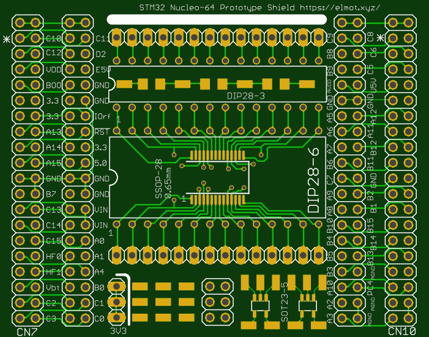

# STM32-Morpho-BRBRD

Prototyping shield for any STM32 Nucleo64 board.

### Features:

* 55x70 mm
* All MCU pins solderable
* Wide DIL-28 footprint
* Narrow DIL-28 footprint
* (T)SSOP-28 (pitch 0.65mm) footprint (bottom)
* SOP-28 (pitch 1.27mm) footprint (top)
* Four SOT23-5 footprints (two per side)
* Six 1206 footprints in two chains (one chain per side)
* Free pads and pins for custom soldering

### NOTE

Original STM Morpho form-factor contains 2 * 19 connectrors. This shield uses 2 * 20 which are easier to buy. Be careful during soldering and connecting the shield to the Nucleo board.

### Status

12-Aug-18: First batch of PCBs submitted to PCB manufacturer
